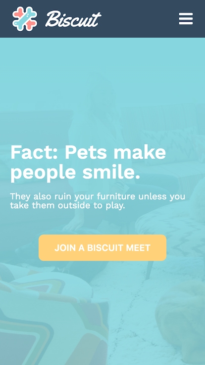
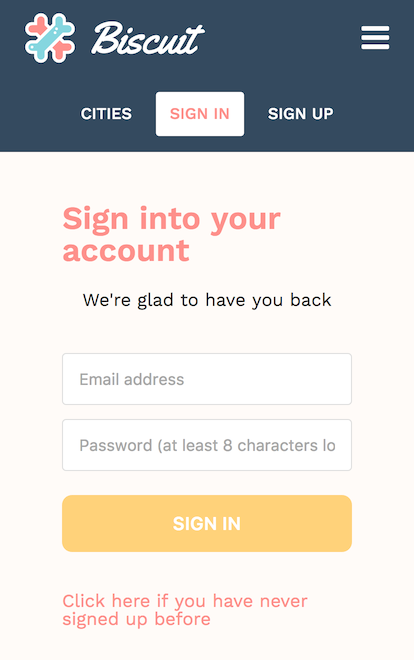
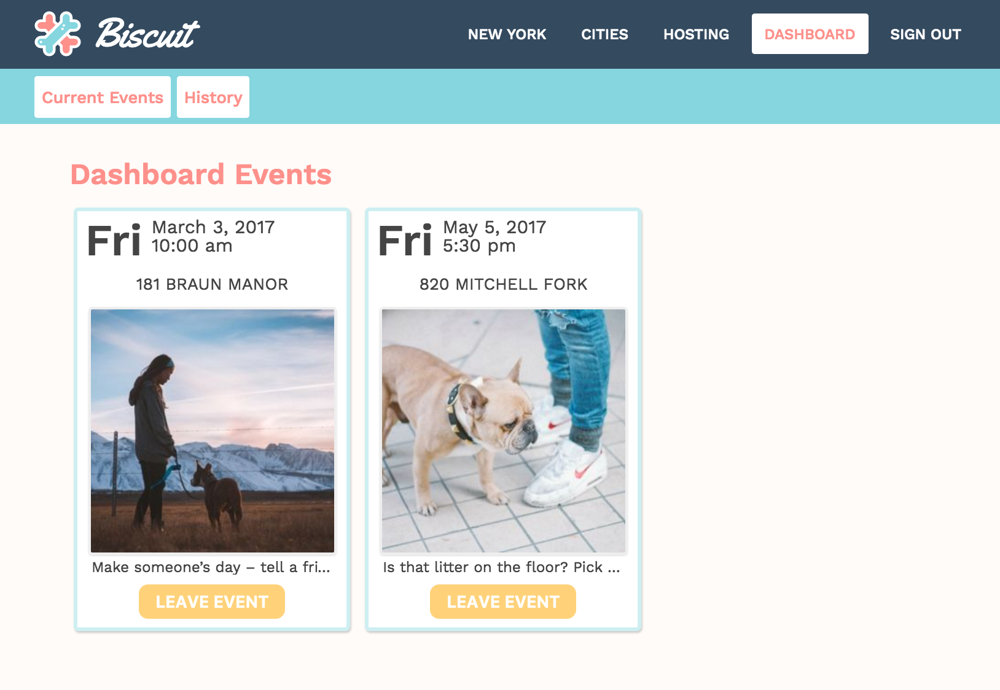

# Biscuit

[Biscuit][Biscuit] is a full-stack web application for unifying strangers together with the help of the furry friends we already welcome in our homes--pets. Inspired by Tea With Strangers, Biscuit allows users to join communities and the events hosted by other members and their friendly pets. It utilizes PostgreSQL, Ruby on Rails, and React.js + Redux. Biscuit is a 'SPA': single-page-application with content delivered via ajax requests to static page.

[Biscuit]: http://www.biscuit-app.com

## Features & Implementation

- User accounts with secure authentication with optional profile image upload.

- Browse available cities, join and change your respective city to access events. Newly created events are immediately available to the community to join.

- The Dashboard has access to current and past events in events. Options to remove attended and hosted events is available at the bottom of each event card.

# Future Directions

- [ ] Google Map API & Event Highlighting
- [ ] Mobile-friendly
- [ ] Set reminders on events
