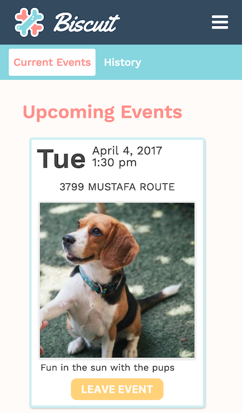

# Biscuit

[Biscuit][Biscuit] is a full-stack web application for unifying strangers together with the help of the furry friends we already welcome in our homes--pets. Inspired by Tea With Strangers, Biscuit allows users to join communities and the events hosted by other members and their friendly pets.

## Features
- User creation and authentication, with persistent credentials
- Fast site loading times due to database indexing and preloading associated data tables
- Users can browse and join a city's events
- Current and past events are saved to the user's dashboard

[Biscuit]: http://www.biscuit-app.com

## Implementation

- User accounts are secured via a randomly generated 128-bit authentication keys. Option image upload on signup allow users to customize their profile when hosting new events.

- Browse available cities, join and change your respective city to access events. Newly created events are immediately available for the community to join. Events that you are participating in do not show up in the list of events.

- The Dashboard has access to current and past events in events. Options to remove attended and hosted events is available at the bottom of each event card. Removing and leaving attended events automatically updates all connected users.

## Project Design
Biscuit was designed and built within two weeks. A sample of the development timeline is available in the [proposal][Proposal]. A database [schema][Schema] was also prepared alongside the design proposal.

[Proposal]:(docs/README.md)
[Schema]:(docs/schema.md)

# Future Directions

- [ ] Google Map API & Event Highlighting
- [ ] Mobile-friendly
- [ ] Set reminders on events
